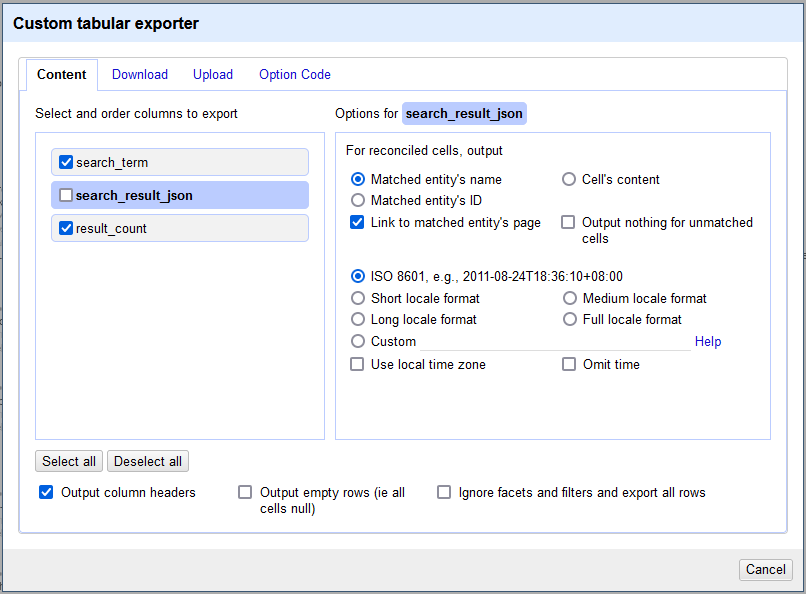
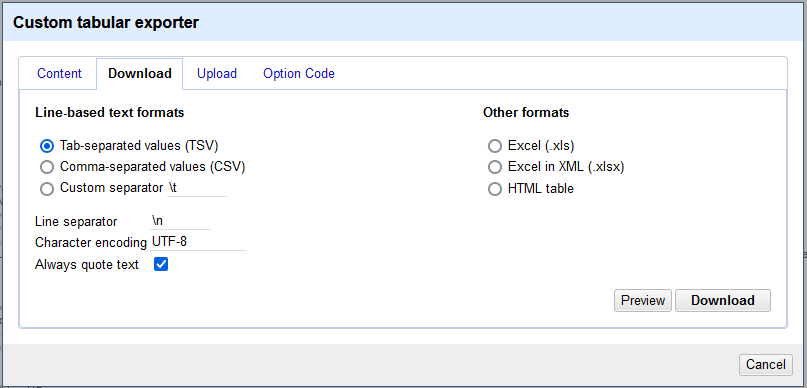
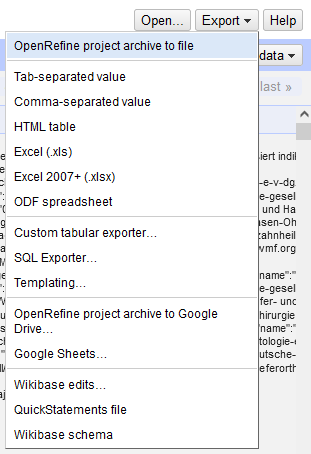
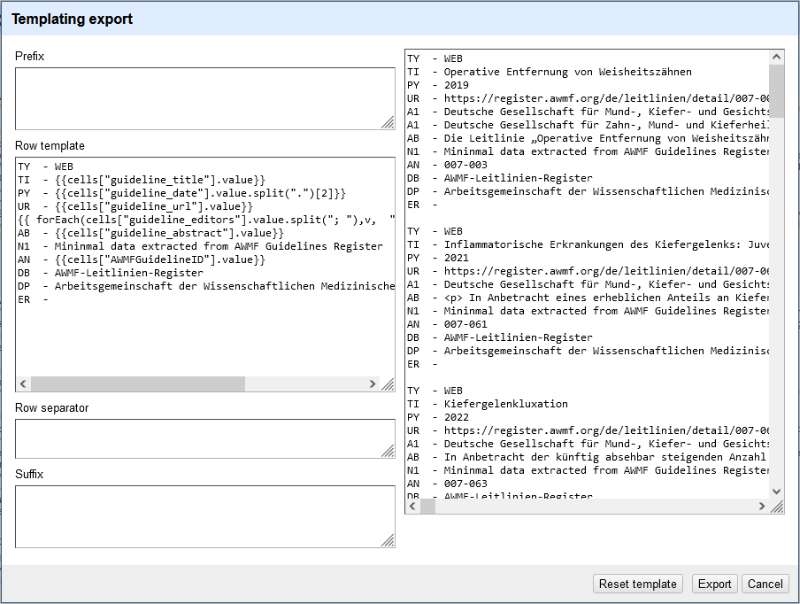

Search AWMF Guideline Register
==============================================================================

The (as of fall 2022) new [Guideline Register](https://register.awmf.org/) of the German medical societies' federation [AWMF](https://www.awmf.org/) has a novel search interface. At the time of writing this text it says that it is in beta state. 

The search capabilities are as yet limited (from an expert searchers point of view). Boolean Operators are not currently supported, nor are brackets (to be used in combination). Boolean operators supposedly are a thing to come in the future. There is no wildcard (such as \*) for truncation but according to a message "truncation ist done automatically". In my experience it is more a kind of linguistic lemmatization that is applied. Nouns and adjectives may ntot be not treated to be the same, according to my limited experience. See examples below.

## Search terms


An example of a list of search terms, each term on its own line:

```

search_term
Kieferorthopädie
kieferorthopädisch
Malokklusion

```

Start a new project in OpenRefine. Paste the search terms from the clipboard or load a text file. The column with the search terms must be named `search_term`. I found it easiest to add the column name as the first line and then choose TSV file format.


## Search using API

The website is using an API that is requested by Ajax calls. We use that API to get nicely formatted JSON. URL pattern: <https://awmf-leitlinien.dev.howto.health/api/dev/search?sorting=relevance&limit=20&offset=0&api_key=MkI5Y1VIOEJ0ZGpoelNBVXRNM1E6WVFld0pBUF9RLVdJa012UHVPTmRQUQ==&lang=de?keywords=search_term>

Foreach of the following code blocks: In the left pane got to the _Undo / Redo_ tab, click the button _Apply..._, paste the code and click on _Perform operations_.

OpenRefine code to carry out the searches:

**Beware**: We just fetch the first **50 records** for each search (`limit` parameter in the query URL). You may need to adjust this value if result counts (see below) are higher than the limit.

```json

[
  {
    "op": "core/column-addition-by-fetching-urls",
    "engineConfig": {
      "facets": [],
      "mode": "row-based"
    },
    "baseColumnName": "search_term",
    "urlExpression": "grel:\"https://awmf-leitlinien.dev.howto.health/api/dev/search?sorting=relevance&limit=50&offset=0&api_key=MkI5Y1VIOEJ0ZGpoelNBVXRNM1E6WVFld0pBUF9RLVdJa012UHVPTmRQUQ==&lang=de&keywords=\" + value",
    "onError": "set-to-blank",
    "newColumnName": "search_result_json",
    "columnInsertIndex": 1,
    "delay": 5000,
    "cacheResponses": true,
    "httpHeadersJson": [
      {
        "name": "authorization",
        "value": ""
      },
      {
        "name": "user-agent",
        "value": "OpenRefine 3.6.1 [5fc8883]"
      },
      {
        "name": "accept",
        "value": "*/*"
      }
    ],
    "description": "Create column search_result_json at index 1 by fetching URLs based on column search_term using expression grel:\"https://awmf-leitlinien.dev.howto.health/api/dev/search?sorting=relevance&limit=50&offset=0&api_key=MkI5Y1VIOEJ0ZGpoelNBVXRNM1E6WVFld0pBUF9RLVdJa012UHVPTmRQUQ==&lang=de&keywords=\" + value"
  }
]

```

Extract the result count for each search:


```json

[
  {
    "op": "core/column-addition",
    "engineConfig": {
      "facets": [],
      "mode": "row-based"
    },
    "baseColumnName": "search_result_json",
    "expression": "grel:value.parseJson().meta.get(\"hits\")",
    "onError": "set-to-blank",
    "newColumnName": "result_count",
    "columnInsertIndex": 2,
    "description": "Create column result_count at index 2 based on column search_result_json using expression grel:value.parseJson().meta.get(\"hits\")"
  }
]

```


## Export search history

At this stage it is convenient to export a search history from OpenRefine, e.g. search terms and their record counts. 

Use the Custom Tabular Exporter to export to a tsv-file:




Here is our [search history](data/AWMF/AWMF_Guideline_Register_search-history.tsv).


## Extract record data

First, we create a record of every guidline entry found.

```json
[
  {
    "op": "core/column-addition",
    "engineConfig": {
      "facets": [],
      "mode": "row-based"
    },
    "baseColumnName": "search_result_json",
    "expression": "grel:value.parseJson().get(\"records\").join(\"|||\")",
    "onError": "set-to-blank",
    "newColumnName": "record_json",
    "columnInsertIndex": 2,
    "description": "Create column record_json at index 2 based on column search_result_json using expression grel:value.parseJson().get(\"records\").join(\"|||\")"
  },
  {
    "op": "core/multivalued-cell-split",
    "columnName": "record_json",
    "keyColumnName": "search_term",
    "mode": "separator",
    "separator": "|||",
    "regex": false,
    "description": "Split multi-valued cells in column record_json"
  }
]

```

We extract some minimal data about the guidelines to be exported into a RIS file.

```json

[
  {
    "op": "core/column-addition",
    "engineConfig": {
      "facets": [],
      "mode": "row-based"
    },
    "baseColumnName": "record_json",
    "expression": "grel:value.parseJson().get(\"AWMFGuidelineID\")",
    "onError": "set-to-blank",
    "newColumnName": "AWMFGuidelineID",
    "columnInsertIndex": 3,
    "description": "Create column AWMFGuidelineID at index 3 based on column record_json using expression grel:value.parseJson().get(\"AWMFGuidelineID\")"
  },
  {
    "op": "core/column-addition",
    "engineConfig": {
      "facets": [],
      "mode": "record-based"
    },
    "baseColumnName": "record_json",
    "expression": "grel:value.parseJson().get(\"name\")",
    "onError": "set-to-blank",
    "newColumnName": "guideline_title",
    "columnInsertIndex": 3,
    "description": "Create column guideline_title at index 3 based on column record_json using expression grel:value.parseJson().get(\"name\")"
  },
  {
    "op": "core/column-addition",
    "engineConfig": {
      "facets": [],
      "mode": "record-based"
    },
    "baseColumnName": "record_json",
    "expression": "grel:value.parseJson().get(\"AWMFDetailPage\")",
    "onError": "set-to-blank",
    "newColumnName": "guideline_url",
    "columnInsertIndex": 3,
    "description": "Create column guideline_url at index 3 based on column record_json using expression grel:value.parseJson().get(\"AWMFDetailPage\")"
  },
  {
    "op": "core/column-addition",
    "engineConfig": {
      "facets": [],
      "mode": "record-based"
    },
    "baseColumnName": "record_json",
    "expression": "grel:forEach(value.parseJson().institutions.leading,v , v.name).join(\"; \")",
    "onError": "set-to-blank",
    "newColumnName": "guideline_editors",
    "columnInsertIndex": 3,
    "description": "Create column guideline_editors at index 3 based on column record_json using expression grel:forEach(value.parseJson().institutions.leading,v , v.name).join(\"; \")"
  },
  {
    "op": "core/column-addition",
    "engineConfig": {
      "facets": [],
      "mode": "record-based"
    },
    "baseColumnName": "record_json",
    "expression": "grel:value.parseJson().get(\"description\")",
    "onError": "set-to-blank",
    "newColumnName": "guideline_abstract",
    "columnInsertIndex": 3,
    "description": "Create column guideline_abstract at index 3 based on column record_json using expression grel:value.parseJson().get(\"description\")"
  },
  {
    "op": "core/column-addition",
    "engineConfig": {
      "facets": [],
      "mode": "record-based"
    },
    "baseColumnName": "record_json",
    "expression": "grel:value.parseJson().get(\"releaseDate\")",
    "onError": "set-to-blank",
    "newColumnName": "guideline_date",
    "columnInsertIndex": 3,
    "description": "Create column guideline_date at index 3 based on column record_json using expression grel:value.parseJson().get(\"releaseDate\")"
  }
]

```

In the following steps we will deduplicate records and therefore delete some data. If a complete record of the data returned from searching the guideline register is wanted then now would be a good time to save an [archive file of the OpenRefine project at the current state of the workflow](data/AWMF/Search_AWMF_Guideline_Register_before_deduplication.openrefine.tar.gz). This file can be imported into OpenRefine for further reference.

Export the project archive:




We are still in records mode with each search term being a record. Now we distill the data down to individual guidelines. This way we go from records mode to row mode.

```json

[
  {
    "op": "core/column-removal",
    "columnName": "result_count",
    "description": "Remove column result_count"
  },
  {
    "op": "core/column-removal",
    "columnName": "search_result_json",
    "description": "Remove column search_result_json"
  },
  {
    "op": "core/column-removal",
    "columnName": "search_term",
    "description": "Remove column search_term"
  }
]

```


### Deduplication

Then we deduplicate the guidelines along [this guide](https://guides.library.illinois.edu/openrefine/duplicates). We use the `AWMFGuidelineID` column to deduplicate.


```json

[
  {
    "op": "core/column-move",
    "columnName": "AWMFGuidelineID",
    "index": 0,
    "description": "Move column AWMFGuidelineID to position 0"
  },
  {
    "op": "core/row-reorder",
    "mode": "row-based",
    "sorting": {
      "criteria": [
        {
          "valueType": "string",
          "column": "AWMFGuidelineID",
          "blankPosition": 2,
          "errorPosition": 1,
          "reverse": false,
          "caseSensitive": false
        }
      ]
    },
    "description": "Reorder rows"
  },
  {
    "op": "core/blank-down",
    "engineConfig": {
      "facets": [],
      "mode": "row-based"
    },
    "columnName": "AWMFGuidelineID",
    "description": "Blank down cells in column AWMFGuidelineID"
  },
  {
    "op": "core/row-removal",
    "engineConfig": {
      "facets": [
        {
          "type": "list",
          "name": "AWMFGuidelineID",
          "expression": "isBlank(value)",
          "columnName": "AWMFGuidelineID",
          "invert": false,
          "omitBlank": false,
          "omitError": false,
          "selection": [
            {
              "v": {
                "v": true,
                "l": "true"
              }
            }
          ],
          "selectBlank": false,
          "selectError": false
        }
      ],
      "mode": "row-based"
    },
    "description": "Remove rows"
  }
]

```


### Number of records found

The total number of records found after deduplication within AWMF by AWMF guideline ID is the number of rows displayed by OpenRefine at this stage above the table. 


## Export of guideline data

We are finished altering the data in the OpenRefine project. So we export an [archival copy of the project](data/AWMF/Search_AWMF_Guideline_Register_after_deduplication.openrefine.tar.gz) as described above.

Now we can export the deduplicated guideline records.


### Export data to a RIS file using the Templating Export

In the form:

* Prefix: empty.
* Suffix: empty.
* Row Separator: Make sure to have an empty line in the so that the records are separated.
* Row Remplate:

For RIS file format see [Wikipedia](https://en.wikipedia.org/wiki/RIS_(file_format))

```

TY  - WEB
TI  - {{cells["guideline_title"].value}}
PY  - {{cells["guideline_date"].value.split(".")[2]}}
UR  - {{cells["guideline_url"].value}}
{{ forEach(cells["guideline_editors"].value.split("; "),v,  "A1  - " + v).join("\n") }}
AB  - {{cells["guideline_abstract"].value}}
N1  - Mininmal data extracted from AWMF Guidelines Register
AN  - {{cells["AWMFGuidelineID"].value}}
DB  - AWMF-Leitlinien-Register
DP  - Arbeitsgemeinschaft der Wissenschaftlichen Medizinischen Fachgesellschaften (AWMF)
ER  - 

```




Resulting [RIS-file](data/AWMF/AWMF_search-results.RIS).

