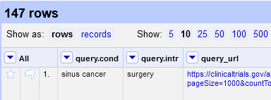

ClinicalTrials.gov
==============================================================================

## Goals

The (as of 2024) new website of [ClinicalTrials.gov](https://www.clinicaltrials.gov/) has no export format for records in a format that can directly be imported into common reference management software. We want to run a search, create a search history and export the records found in RIS format.


## Searching in ClinicalTrials.gov

Advice on the search syntax of ClinicalTrials.gov is available in Table 2 of: Hunter K E, Webster A C, Page M J, Willson M, McDonald S, Berber S et al. Searching clinical trials registers: guide for systematic reviewers. _BMJ_ 2022; 377 :e068791 doi:[10.1136/bmj-2021-068791](https://doi.org/10.1136/bmj-2021-068791).

We will use the [expert search syntax](https://classic.clinicaltrials.gov/api/gui/ref/syntax) of ClinicalTrials.gov to search via the new [ClinicalTrials.gov API](https://www.clinicaltrials.gov/data-api/api).

Note (see [here](https://www.clinicaltrials.gov/data-api/api#refs)):

> Please note that the COVERAGE and EXPANSION operators are not fully implemented on the modernized ClinicalTrials.gov.

Here we use only a selection of the fields available for searching. This can be extended at any time.


### Population

Searching in the `Conditons/disease` field of the [search form](https://www.clinicaltrials.gov/) is equivalent to searching in the [ConditionSearch Area](https://www.clinicaltrials.gov/data-api/about-api/search-areas#ConditionSearch) with `AREA[ConditionSearch](<search terms>)` using the expert search syntax or using the `query.cond` parameter of the API as we do here.


### Intervention

Searching in `Intervention/treatment` of the [search form](https://www.clinicaltrials.gov/) is equivalent to searching in the [InterventionSearch Area](https://www.clinicaltrials.gov/data-api/about-api/search-areas#InterventionSearch) with `AREA[InterventionSearch](<search terms>)` using the expert search syntax or using the `query.intr` parameter of the API as we do here.

### Outcome

Searching in `Outcome measure` of the [search form](https://www.clinicaltrials.gov/) is equivalent to searching in the [OutcomeSearch Area](https://www.clinicaltrials.gov/data-api/about-api/search-areas#OutcomeSearch) with `AREA[OutcomeSearch](<search terms>)` using the expert search syntax or using the `query.outc` parameter of the API as we do here.

### Expert query syntax

It is also possible to filter with a query string in [Essie expression syntax](https://classic.clinicaltrials.gov/api/gui/ref/syntax). This will allow for advanced searching. The query string will be sent in the `filter.advanced` parameter of the API.

### Combination of concepts

The individual search components will be combined with the Boolean operator AND by specifying the respective query parameters for each search string in the API call.


## Prepared search strategy

We prepare the search strategy in an Excel file with only two rows. In the first row the API fields as given above are used as column headers. In the second row the search strings for the respective fields are entered.

**Remove the columns for fields that you do not want to search!** Empty search strings in a field may result in zero hits even though there are matching trial records when carrying out the same search in the search form in the browser.

[Here](data/ctgov_search_strategy_template.xlsx) is a template file.


## Process in OpenRefine

### Create a new project from an Excel file

From the [template file](data/ctgov_search_strategy_template.xlsx) we created an [Excel file with an example prepared search strategy](data/ctgov_prepared_search_strategy.xlsx). Note that we only have two search blocks und thus only two columns maust remain!


### Build the URL and run the search

We build a new column `query_url` based on any one of the existing ones by using the column names as HTTP parameters and the cells content as the values of these parameters:

```grel
"https://clinicaltrials.gov/api/v2/studies?" +
"pageSize=1000&" +
"countTotal=true&" +
forEach(
  row.columnNames,
  cn,
  cn + "=" + cells[cn].value.toString().strip().escape("url")
).join("&")
```

It may be convenient to move the `query_url` column to the rightmost position after that action.

Here is the operation history JSON to be applied for our example. Plese, note that this assuems a column `query.cond` to exist:

```json
[
  {
    "op": "core/column-addition",
    "engineConfig": {
      "facets": [],
      "mode": "row-based"
    },
    "baseColumnName": "query.cond",
    "expression": "grel:\"https://clinicaltrials.gov/api/v2/studies?\" +\n\"pageSize=1000&\" +\n\"countTotal=true&\" +\nforEach(\n  row.columnNames,\n  cn,\n  cn + \"=\" + cells[cn].value.toString().strip().escape(\"url\")\n).join(\"&\")",
    "onError": "set-to-blank",
    "newColumnName": "query_url",
    "columnInsertIndex": 1,
    "description": "Create column query_url at index 1 based on column query.cond using expression grel:\"https://clinicaltrials.gov/api/v2/studies?\" +\n\"pageSize=1000&\" +\n\"countTotal=true&\" +\nforEach(\n  row.columnNames,\n  cn,\n  cn + \"=\" + cells[cn].value.toString().strip().escape(\"url\")\n).join(\"&\")"
  },
  {
    "op": "core/column-move",
    "columnName": "query_url",
    "index": 2,
    "description": "Move column query_url to position 2"
  }
]
```

We then use the `query_url` to search the API and store the result returned in a column `query_result`:


```json

[
  {
    "op": "core/column-addition-by-fetching-urls",
    "engineConfig": {
      "facets": [],
      "mode": "row-based"
    },
    "baseColumnName": "query_url",
    "urlExpression": "grel:value",
    "onError": "set-to-blank",
    "newColumnName": "query_result",
    "columnInsertIndex": 3,
    "delay": 500,
    "cacheResponses": true,
    "httpHeadersJson": [
      {
        "name": "authorization",
        "value": ""
      },
      {
        "name": "if-modified-since",
        "value": ""
      },
      {
        "name": "accept-language",
        "value": ""
      },
      {
        "name": "accept-encoding",
        "value": ""
      },
      {
        "name": "user-agent",
        "value": "OpenRefine 3.8.0 [TRUNK]"
      },
      {
        "name": "accept",
        "value": "*/*"
      },
      {
        "name": "accept-charset",
        "value": ""
      }
    ],
    "description": "Create column query_result at index 3 by fetching URLs based on column query_url using expression grel:value"
  }
]

```


### Search results

The query result contains the matching records up to the maximum of 1,000 records allowed by the API. Here we don't cover downloading more records in batches.

First we extract the `result count` from the JSON returned by the API with the following GREL code:

```grel
value.parseJson().totalCount
```

The operation history JSON:


```json

[
  {
    "op": "core/column-addition",
    "engineConfig": {
      "facets": [],
      "mode": "row-based"
    },
    "baseColumnName": "query_result",
    "expression": "grel:value.parseJson().totalCount",
    "onError": "set-to-blank",
    "newColumnName": "result_count",
    "columnInsertIndex": 4,
    "description": "Create column result_count at index 4 based on column query_result using expression grel:value.parseJson().totalCount"
  }
]

```


### Search history

At this time it may be convenient to export a search history.

Use the _Custom tabular exporter_, select as content all query parameters as imported from the Excel file `query.*`, the `query_url` and the `result_count` columns. Use the "Tab-separated values (TSV)" format in the download tab.

[Here](data/ctgov_search-history.tsv) is the search history table from our example search.


### Split into study records

Then we extract the `studies` array from the JSON and join all study records into a single string. We separate the study records with the string "|||DOCUMENT\_SEPARATOR|||":

```grel
value.parseJson().studies.join("|||DOCUMENT_SEPARATOR|||")
```

Then we split the multi-valued cell in the column `study_json` at the separator string "|||DOCUMENT\_SEPARATOR|||" that we introduced before. As a result we still have one record in OpenRefine but every study in JSON format in its own row. Change to "rows" view in OpenRefine to see that!



The operation history JSON:

```json

[
  {
    "op": "core/column-addition",
    "engineConfig": {
      "facets": [],
      "mode": "record-based"
    },
    "baseColumnName": "query_result",
    "expression": "grel:value.parseJson().studies.join(\"|||DOCUMENT_SEPARATOR|||\")",
    "onError": "set-to-blank",
    "newColumnName": "study_json",
    "columnInsertIndex": 4,
    "description": "Create column study_json at index 4 based on column query_result using expression grel:value.parseJson().studies.join(\"|||DOCUMENT_SEPARATOR|||\")"
  },
  {
    "op": "core/multivalued-cell-split",
    "columnName": "study_json",
    "keyColumnName": "query.cond",
    "mode": "separator",
    "separator": "|||DOCUMENT_SEPARATOR|||",
    "regex": false,
    "description": "Split multi-valued cells in column study_json"
  }
]

```

### Extract metadata fields

Now we have to extract metadata from the `study_json` column that we can then reassemble into a RIS record. 

The the data elements' meaning and where they are located in the documents (Study Data Structure) is documented [here](https://www.clinicaltrials.gov/data-api/about-api/study-data-structure). Unfortunately, the actual naming of the objects in the JSON somewhat deviates from that and is found in the API's schema found [here](https://www.clinicaltrials.gov/data-api/api).

We start with the studies' National Clinical Trial (NCT) Identification Number (NCTId) and store it in a column `accession_number`. The GREL code to extract this element from the `study_json` column:

```grel
value.parseJson().protocolSection.identificationModule.nctId
```

The official `title` may be empty so we take the best that we can get. We escape newlines so as not to run into troubles with linebreaks in the RIS file:

```grel
if (
  value.parseJson().protocolSection.identificationModule.officialTitle.length() > 0,
  value.parseJson().protocolSection.identificationModule.officialTitle.replace("\n", "\\n"),
  value.parseJson().protocolSection.identificationModule.briefTitle.replace("\n", "\\n")
)
```

For the `year` we extract the first part of the date:

```grel
value.parseJson().protocolSection.statusModule.studyFirstPostDateStruct.date.substring(0, 4)
```

An `abstract` may be found in two fields. We need to employ the [coalesce() function](https://openrefine.org/docs/manual/grelfunctions#coalesceo1-o2-o3-) to replace missing elements with an empty string:

```grel
if (
  coalesce(value.parseJson().protocolSection.descriptionModule.detailedDescription, "").length() > 0,
  value.parseJson().protocolSection.descriptionModule.detailedDescription.replace("\n", "\\n"),
  coalesce(value.parseJson().protocolSection.descriptionModule.briefSummary, "").replace("\n", "\\n")
)
```

The operation history JSON:

```json

[
  {
    "op": "core/column-addition",
    "engineConfig": {
      "facets": [],
      "mode": "row-based"
    },
    "baseColumnName": "study_json",
    "expression": "grel:value.parseJson().protocolSection.identificationModule.nctId",
    "onError": "set-to-blank",
    "newColumnName": "accession_number",
    "columnInsertIndex": 5,
    "description": "Create column accession_number at index 5 based on column study_json using expression grel:value.parseJson().protocolSection.identificationModule.nctId"
  },
  {
    "op": "core/column-addition",
    "engineConfig": {
      "facets": [],
      "mode": "row-based"
    },
    "baseColumnName": "study_json",
    "expression": "grel:if (\n  value.parseJson().protocolSection.identificationModule.officialTitle.length() > 0,\n  value.parseJson().protocolSection.identificationModule.officialTitle.replace(\"\\n\", \"\\\\n\"),\n  value.parseJson().protocolSection.identificationModule.briefTitle.replace(\"\\n\", \"\\\\n\")\n)",
    "onError": "set-to-blank",
    "newColumnName": "title",
    "columnInsertIndex": 5,
    "description": "Create column title at index 5 based on column study_json using expression grel:if (\n  value.parseJson().protocolSection.identificationModule.officialTitle.length() > 0,\n  value.parseJson().protocolSection.identificationModule.officialTitle.replace(\"\\n\", \"\\\\n\"),\n  value.parseJson().protocolSection.identificationModule.briefTitle.replace(\"\\n\", \"\\\\n\")\n)"
  },
  {
    "op": "core/column-addition",
    "engineConfig": {
      "facets": [],
      "mode": "row-based"
    },
    "baseColumnName": "study_json",
    "expression": "grel:value.parseJson().protocolSection.statusModule.studyFirstPostDateStruct.date.substring(0, 4)",
    "onError": "set-to-blank",
    "newColumnName": "year",
    "columnInsertIndex": 5,
    "description": "Create column year at index 5 based on column study_json using expression grel:value.parseJson().protocolSection.statusModule.studyFirstPostDateStruct.date.substring(0, 4)"
  },
  {
    "op": "core/column-addition",
    "engineConfig": {
      "facets": [],
      "mode": "row-based"
    },
    "baseColumnName": "study_json",
    "expression": "grel:if (\n  coalesce(value.parseJson().protocolSection.descriptionModule.detailedDescription, \"\").length() > 0,\n  value.parseJson().protocolSection.descriptionModule.detailedDescription.replace(\"\\n\", \"\\\\n\"),\n  coalesce(value.parseJson().protocolSection.descriptionModule.briefSummary, \"\").replace(\"\\n\", \"\\\\n\")\n)",
    "onError": "set-to-blank",
    "newColumnName": "abstract",
    "columnInsertIndex": 5,
    "description": "Create column abstract at index 5 based on column study_json using expression grel:if (\n  coalesce(value.parseJson().protocolSection.descriptionModule.detailedDescription, \"\").length() > 0,\n  value.parseJson().protocolSection.descriptionModule.detailedDescription.replace(\"\\n\", \"\\\\n\"),\n  coalesce(value.parseJson().protocolSection.descriptionModule.briefSummary, \"\").replace(\"\\n\", \"\\\\n\")\n)"
  }
]

```


### Export to RIS file

We use the _Templating exporter_.

This is the _Row template_ to use:

```
TY  - WEB
TI  - {{cells["title"].value}}
PY  - {{cells["year"].value}}
UR  - {{"https://www.clinicaltrials.gov/study/" + cells["accession_number"].value}}
RD  - {{now().toString("yyyy-MM-dd")}}
AN  - {{cells["accession_number"].value}}
DB  - ClinicalTrials.gov
DP  - U.S. National Library of Medicine
AB  - {{cells["abstract"].value}}
ER  - 

```

_Prefix_, _Row separator_ and _Suffix_ should all be empty.

We make all RIS records to be of the type "Web page" and set the current date as the date retrieved.

The exported RIS file is [here](data/ctgov_records.ris).


## All in one go

The complete operation history was saved to a [JSON file](data/ctgov_operation_history.json). This can be applied to a project newly created from a prepared search history based on the [template Excel file](data/ctgov_search_strategy_template.xlsx).

So it should be no more than a matter of seconds to carry out a search from a prepared search strategy, download the records (**no more than 1000, though**) and extract the metadata fields. Then export the RIS file based on the _Row template_ above.

Do not forget to also export the search history (see above) and an OpenRefine archive file for full reproducibility. The one from our example is [here](data/ClinicalTrials.gov.openrefine.tar.gz).

