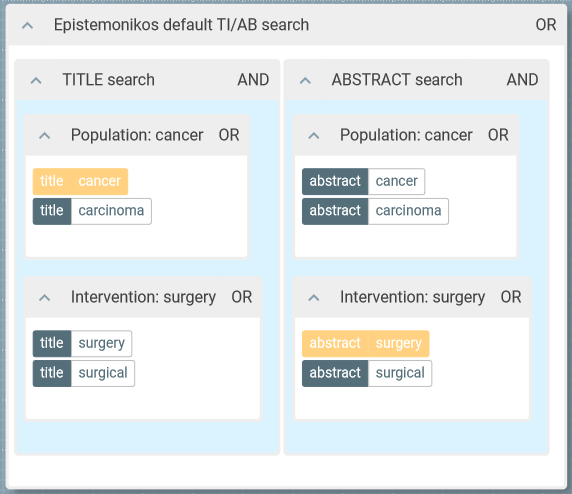

Epistemonikos
==============================================================================

Issues with the Epistemonikos search platform  that I experienced:

* The Epistemonikos website handles query strings entered in unpredictable ways. Sometimes unwanted field codes are added to the search strings. This may corrupt the search but possibly go unnoticed. Various forms of a search string may be shown in the search forms. It is not always obvious what is actually searched.

* The URL shown in the browser is not a reliable reflection of what is going on in the web page or what is being searched and may be misleading.

* For title-and-abstract searches the search form acts differently from what is usually done in other interfaces. This may deviate from the intention of a searcher.

We try to tackle these with the help of OpenRefine.


## Title/Abstract searches

Entering a search string `block_1 AND block_2` in the _Title/Abstract_ field of the advanced search form is translated into a search string `(title:(block_1 AND block_2) OR abstract:(block_1 AND block_2))`. This will not find records where _block_1_ terms occur in the title field and _block_2_ terms in the abstract field only. And vice versa. This may come unexpected.

Therefore, the following structure of the search strategy may be preferable as it is more sensitive but it is not created by Epistemonikos' search form:

```
(title:(block_1) OR abstract:(block_1))
AND 
(title:(block_2) OR abstract:(block_2))
```

To give a concrete example, we search for:

* Population: cancer
* Intervention: surgery

When entering a (not particularly good) search string as a single line we get the following in the Epistemonikos advanced search form:


* String entered in Titel/Abstract field: `(cancer OR carcinoma) AND (surgery OR surgical)`
* String shown in query box: `(title:((cancer OR carcinoma) AND (surgery OR surgical)) OR abstract:((cancer OR carcinoma) AND (surgery OR surgical)))`

The structure of this search as illustrated with [2Dsearch](https://app.2dsearch.com/):



When the term `cancer` is present only in the title and the term `surgery` only in the abstract of a document this document would not be found.

The structure of the title/abstract search "Population AND Intervention" should rather be like this:

```
(title:(cancer OR carcinoma) OR abstract:(cancer OR carcinoma))
AND 
(title:(surgery OR surgical) OR abstract:(surgery OR surgical))
```


## The Epistemonikos website

[Epistemonikos](https://www.epistemonikos.org/) has a [documented API](https://api.epistemonikos.org). Accessing this API requires a registration process with the people from Epistemonikos. It is not clear who will be allowed access. Is is not documented whether searching for documents with this API is the same as when searching in the web forms.

However, the Advanced Search form also uses an API for it to function, a different one. JavaScript code running in the browser is sending the search string to this API to do the actual searching and as the response receives a result set with documents which then is used for display. This can be seen when using the developer tools of the web browser. 

We can call this publicly available API with OpenRefine rather than with the JavaScript code in the browser. Then we know exactly what search string we are sending. But we don't do anything else than the browser does, too.

The API used by the Advanced search form with an example search string. A [JSON](https://en.wikipedia.org/wiki/JSON)-formatted text document with the first 10 records and the total number of records matching the query is returned:

<https://www.epistemonikos.org/en/api/documents?classification=all&countries=all&pmc=all&study_design=all&systematic_review_type=all&type_of_meta_analysis=all&protocol=no&q=&page=1&query=%28title%3A%28cancer%20OR%20carcinoma%29%20OR%20abstract%3A%28cancer%20OR%20carcinoma%29%29%20AND%20%28title%3A%28surgery%20OR%20surgical%29%20OR%20abstract%3A%28surgery%20OR%20surgical%29%29%20AND%20%28title%3A%28immunology%29%20OR%20abstract%3A%28immunology%29%29>

The URL parameter `q` apparently has no influence on the actual search. The web app running in the browser may carry over previous search strings in this parameter. Apparently, this can end up in a different search strategy shown in the web page from that actually being searched. We will leave this parameter `q` empty so as not to cause confusion.

The URL parameter `query` is the actual search string.

The other parameters are filters and used for paging the result list.


### RIS download

In an example search the following URL was used by the web page to download results in RIS format: <https://www.epistemonikos.org/en/documents/documents_ris?classification=all&countries=all&pmc=all&protocol=no&q=&query=(title:(cancer OR carcinoma) OR abstract:(cancer OR carcinoma)) AND (title:(surgery OR surgical) OR abstract:(surgery OR surgical)) AND (title:(immunology) OR abstract:(immunology))&size=100&study_design=all&systematic_review_type=all&type_of_meta_analysis=all>

The result is a JSON document that wraps the individual records in RIS format. In the web page only up to 100 records in RIS format are offered for download without registration. More are possible after login. But the size parameter in this URL allows for larger numbers. After login the web page offers to download up to 1000, 5000 or 10000 records, although in a somwewhat different fashion. There seems to be no paging with this URL. So be careful not to send a request to this endpoint with a query that yields too many records! We do not want to put Epistemonikos under stress.

The URL such that the search string can be appended (in URL encoded form):

```
https://www.epistemonikos.org/en/documents/documents_ris?classification=all&countries=all&pmc=all&protocol=no&study_design=all&systematic_review_type=all&type_of_meta_analysis=all&q=&size=100&query=
```


Using OpenRefine
==============================================================================

## Goals

* We want to search Epistemonikos with a single line search strategy composed of two or more search blocks that are combined with AND. These blocks could refer to the PICO model.
* We want a proper title-and-abstract search where search terms from the search blocks may occur in either title or abstract. Not the way Epistemonikos behaves when using the _Title/Abstract_ field in advanced search. See above for more information.
* We want to avoid that the Epistemonikos search forms in the browser introduce unwanted (and possibly unnoticed) modifications to our search strategy.
* We want a proper search documentation with exactly the search string that was sent to the search engine and was used to return documents.
* We want to download the records from exactly that search as a RIS file.


## Approach

While it is possible to build the complete search string manually here we use OpenRefine to assemble the pieces. This process is described below. However, it is important to note that this assembly is optional. These steps can be skipped and a search string in its final intended form may be provided that will be sent unaltered to the Epistemonikos API.

* We start with an Excel file where the search strings of the individual search blocks are in separate cells next to each other, i.e. in separate columns in a single row. The first row in the Excel file holds the column names, i.e. _block_1_, _block_2_ and _block\_3_.
* The search string with the full structure of the search strategy in the following form is built by OpenRefine:

```
(title:(block_1) OR abstract:(block_1))
AND 
(title:(block_2) OR abstract:(block_2))
AND 
(title:(block_3) OR abstract:(block_3))
```

* OpenRefine sends the search string directly to the API that is also used by JavaScript code of the search forms of Epistemonikos. We circumvent that the search string entered in the search forms' input fields is handled (and possibly modified in an unintended way) by the JavaScript code.
* From that API we retrieve the JSON containing the search results. We need to fetch the results in chunks of 10 records as this is what the web page uses.
* We extract metadata fields from the JSON so taht we can export the records in RIS format.


## Step by step

### Assemble the search strategy

I found it convenient to prepare the search strings **without field codes** in an Excel file which each search block in a single cell. For _population_, _intervention_ and _outcome_ I used the more general terms _block\_1_, _block\_2_ and _block\_3_: 


| block\_1            | block\_2            | block\_3    |
| ------------------- | ------------------- | ----------- |
| cancer OR carcinoma | surgery OR surgical | immunology  |

This [Excel file](data/Epistemonikos/Epistemonikos_search_blocks.xlsx) can be loaded into OpenRefine.

This is what the imported search strategy looks like in OpenRefine:


In OpenRefine the search string is constructed with the following GREL expression. It is possible to have as many search blocks/columns as suits your need. They will all be combined with AND in the final search string. Terms from each search block may occur in either title or abstract or both. 

```grel

forEach(
  row.columnNames, 
  v, 
  "(title:(" + cells[v].value + ") OR abstract:(" + cells[v].value + "))"
).join(" AND ")

```

We then move the column named `search_string` to the leftmost position.

The operation history JSON to be applied in OpenRefine:

```json

[
  {
    "op": "core/column-addition",
    "engineConfig": {
      "facets": [],
      "mode": "row-based"
    },
    "baseColumnName": "block_1",
    "expression": "grel:forEach(\n  row.columnNames, \n  v, \n  \"(title:(\" + cells[v].value + \") OR abstract:(\" + cells[v].value + \"))\"\n).join(\" AND \")",
    "onError": "set-to-blank",
    "newColumnName": "search_string",
    "columnInsertIndex": 1,
    "description": "Create column search_string at index 1 based on column block_1 using expression grel:forEach(\n  row.columnNames, \n  v, \n  \"(title:(\" + cells[v].value + \") OR abstract:(\" + cells[v].value + \"))\"\n).join(\" AND \")"
  },
  {
    "op": "core/column-move",
    "columnName": "search_string",
    "index": 0,
    "description": "Move column search_string to position 0"
  }
]

```


### Search using the API

GREL code to build the URL:

```grel

"https://www.epistemonikos.org/en/api/documents?classification=all&countries=all&pmc=all&study_design=all&systematic_review_type=all&type_of_meta_analysis=all&protocol=no&q=" +
"&page=1" +
"&query=" + escape(value, "url")

```

The operation history JSON to be applied in OpenRefine:

```json

[
  {
    "op": "core/column-addition",
    "engineConfig": {
      "facets": [],
      "mode": "row-based"
    },
    "baseColumnName": "search_string",
    "expression": "grel:\"https://www.epistemonikos.org/en/api/documents?classification=all&countries=all&pmc=all&study_design=all&systematic_review_type=all&type_of_meta_analysis=all&protocol=no&q=\" +\n\"&page=1\" +\n\"&query=\" + escape(value, \"url\")",
    "onError": "set-to-blank",
    "newColumnName": "search_url",
    "columnInsertIndex": 1,
    "description": "Create column search_url at index 1 based on column search_string using expression grel:\"https://www.epistemonikos.org/en/api/documents?classification=all&countries=all&pmc=all&study_design=all&systematic_review_type=all&type_of_meta_analysis=all&protocol=no&q=\" +\n\"&page=1\" +\n\"&query=\" + escape(value, \"url\")"
  },
  {
    "op": "core/column-addition-by-fetching-urls",
    "engineConfig": {
      "facets": [],
      "mode": "row-based"
    },
    "baseColumnName": "search_url",
    "urlExpression": "grel:value",
    "onError": "set-to-blank",
    "newColumnName": "first_search",
    "columnInsertIndex": 2,
    "delay": 500,
    "cacheResponses": true,
    "httpHeadersJson": [
      {
        "name": "authorization",
        "value": ""
      },
      {
        "name": "user-agent",
        "value": "OpenRefine 3.7.4 [05e9de9]"
      },
      {
        "name": "accept",
        "value": "*/*"
      }
    ],
    "description": "Create column first_search at index 2 by fetching URLs based on column search_url using expression grel:value"
  }
]

```


### Search result

Our search yields a JSON document with some general information about the search result and a chunk with the first records. It looks as if only 10 records at a time can be obtained from the API we are using here. If there are more than 10 records in the search result these have to be obtained by paging through the list. This we will do in the next section.

First we extract the result count from the JSON. In addition, a field _search_status_ is present which we extract, too. The exact meaning of this status is not clear to me but we probabaly want that the status is "ok".

```json

[
  {
    "op": "core/column-addition",
    "engineConfig": {
      "facets": [],
      "mode": "row-based"
    },
    "baseColumnName": "first_search",
    "expression": "grel:value.parseJson().total_results",
    "onError": "set-to-blank",
    "newColumnName": "total_results",
    "columnInsertIndex": 1,
    "description": "Create column total_results at index 1 based on column first_search using expression grel:value.parseJson().total_results"
  },
  {
    "op": "core/column-addition",
    "engineConfig": {
      "facets": [],
      "mode": "row-based"
    },
    "baseColumnName": "first_search",
    "expression": "grel:value.parseJson().search_status",
    "onError": "set-to-blank",
    "newColumnName": "first_search_status",
    "columnInsertIndex": 2,
    "description": "Create column first_search_status at index 2 based on column first_search using expression grel:value.parseJson().search_status"
  }
]

```


### Directly download RIS

The GREL code to build the RIS download link: 

```grel
if (
  cells["total_results"].value <= 10000,
  "https://www.epistemonikos.org/en/documents/documents_ris?classification=all&countries=all&pmc=all&protocol=no&study_design=all&systematic_review_type=all&type_of_meta_analysis=all&q="
  + "&size=" + cells["total_results"].value.escape("url")
  + "&query=" + cells["search_string"].value.escape("url"),
  "ERROR: total_results is larger than allowed!"
)
```

Based on this URL we download a JSON document wrapping the RIS records and then join these into a single text string.

In addition we also count the number of RIS records downloaded. This should match up with the `total_results`.

The operation history JSON:

```json

[
  {
    "op": "core/column-addition-by-fetching-urls",
    "engineConfig": {
      "facets": [],
      "mode": "row-based"
    },
    "baseColumnName": "ris_download_url",
    "urlExpression": "grel:value",
    "onError": "set-to-blank",
    "newColumnName": "ris_json",
    "columnInsertIndex": 5,
    "delay": 500,
    "cacheResponses": true,
    "httpHeadersJson": [
      {
        "name": "authorization",
        "value": ""
      },
      {
        "name": "if-modified-since",
        "value": ""
      },
      {
        "name": "accept-language",
        "value": ""
      },
      {
        "name": "accept-encoding",
        "value": ""
      },
      {
        "name": "user-agent",
        "value": "OpenRefine 3.8.0 [TRUNK]"
      },
      {
        "name": "accept",
        "value": "*/*"
      },
      {
        "name": "accept-charset",
        "value": ""
      }
    ],
    "description": "Create column ris_json at index 5 by fetching URLs based on column ris_download_url using expression grel:value"
  },
  {
    "op": "core/column-addition",
    "engineConfig": {
      "facets": [],
      "mode": "row-based"
    },
    "baseColumnName": "ris_json",
    "expression": "grel:value.parseJson().ris_content.join(\"\\n\\n\")",
    "onError": "set-to-blank",
    "newColumnName": "ris",
    "columnInsertIndex": 6,
    "description": "Create column ris at index 6 based on column ris_json using expression grel:value.parseJson().ris_content.join(\"\\n\\n\")"
  },
  {
    "op": "core/column-addition",
    "engineConfig": {
      "facets": [],
      "mode": "row-based"
    },
    "baseColumnName": "ris_json",
    "expression": "grel:value.parseJson().ris_content.length()",
    "onError": "set-to-blank",
    "newColumnName": "count_ris_records",
    "columnInsertIndex": 6,
    "description": "Create column count_ris_records at index 6 based on column ris_json using expression grel:value.parseJson().ris_content.length()"
  }
]

```


### Export the search history

Use the _Custom tabular exporter_. Apply the following "Option code". Then go to the "Download" tab and click the "Download" button.

```json

{
  "format": "tsv",
  "separator": "\t",
  "lineSeparator": "\n",
  "encoding": "UTF-8",
  "quoteAll": true,
  "outputColumnHeaders": true,
  "outputBlankRows": false,
  "columns": [
    {
      "name": "search_string",
      "reconSettings": {
        "output": "entity-name",
        "blankUnmatchedCells": false,
        "linkToEntityPages": true
      },
      "dateSettings": {
        "format": "iso-8601",
        "useLocalTimeZone": false,
        "omitTime": false
      }
    },
    {
      "name": "total_results",
      "reconSettings": {
        "output": "entity-name",
        "blankUnmatchedCells": false,
        "linkToEntityPages": true
      },
      "dateSettings": {
        "format": "iso-8601",
        "useLocalTimeZone": false,
        "omitTime": false
      }
    },
    {
      "name": "first_search_status",
      "reconSettings": {
        "output": "entity-name",
        "blankUnmatchedCells": false,
        "linkToEntityPages": true
      },
      "dateSettings": {
        "format": "iso-8601",
        "useLocalTimeZone": false,
        "omitTime": false
      }
    },
    {
      "name": "search_url",
      "reconSettings": {
        "output": "entity-name",
        "blankUnmatchedCells": false,
        "linkToEntityPages": true
      },
      "dateSettings": {
        "format": "iso-8601",
        "useLocalTimeZone": false,
        "omitTime": false
      }
    },
    {
      "name": "ris_download_url",
      "reconSettings": {
        "output": "entity-name",
        "blankUnmatchedCells": false,
        "linkToEntityPages": true
      },
      "dateSettings": {
        "format": "iso-8601",
        "useLocalTimeZone": false,
        "omitTime": false
      }
    },
    {
      "name": "count_ris_records",
      "reconSettings": {
        "output": "entity-name",
        "blankUnmatchedCells": false,
        "linkToEntityPages": true
      },
      "dateSettings": {
        "format": "iso-8601",
        "useLocalTimeZone": false,
        "omitTime": false
      }
    }
  ]
}

```

The resulting TSV file is [here](data/Epistemonikos-search-history.tsv).


### Export the records to RIS file

Records in RIS format are in a single cell in the column `ris`. We export this with the _Templating exporter_. This is the "Row template":

```
{{cells["ris"].value}}
```

"Prefix", "Row separator" and "Suffix" must be empty.

The resulting RIS file is [here](data/Epistemonikos_records.ris).


### Document everything with an OpenRefine project archive

The whole process and all data downloaded is contained in the OpenRefine project. This is a complete and reproducible documentation of the search process. Download this to an archive file that can later be loaded back into an OpenRefine instance to serve various purposes. 

Go to "Export" > "OpenRefine project archive to file" and save as a tar.gz-file.

[Here](data/Epistemonikos-direct-RIS-download.openrefine.tar.gz) is the archive of what we did.


## All in one go

Above, all steps were documented in order to follow along. The complete action history exported afterwards can be used to speed up the process.

1. Create a new project from an Excel file based on [this template](data/Epistemonikos_search_blocks.xlsx). Add or delete columns (search blocks) in the Excel file as needed when entering the search strings.

2. Apply the complete operation history by selecting [this file](data/Epistemonikos_history.json).

3. Export the search history as detailed above.

4. Export the records to RIS file as detailed above.

5. Export an OpenRefine project archive as detailed above for a complete documentation of the search process.

